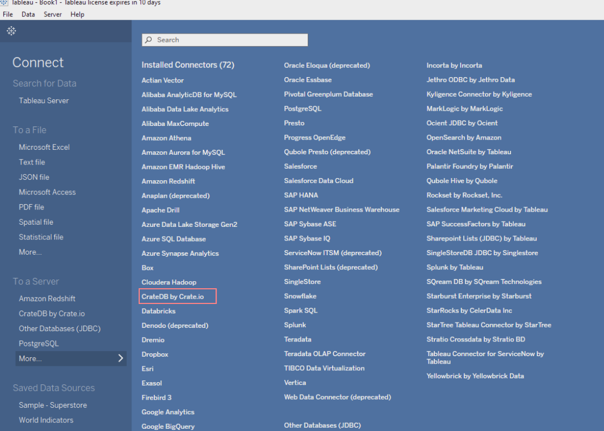
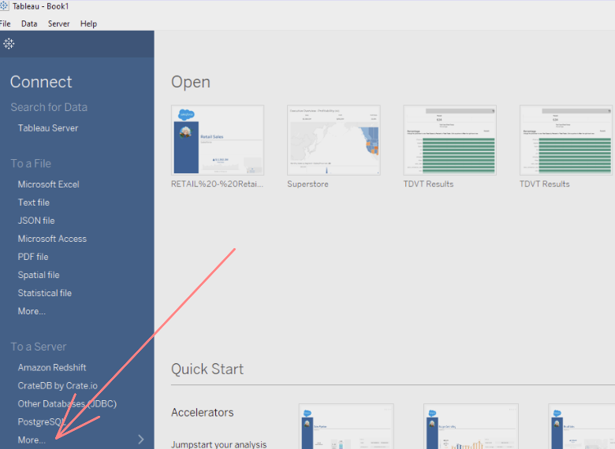
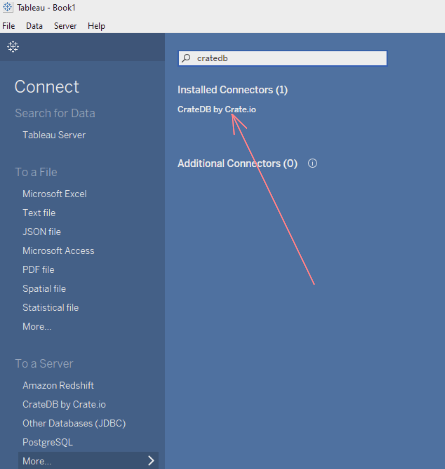
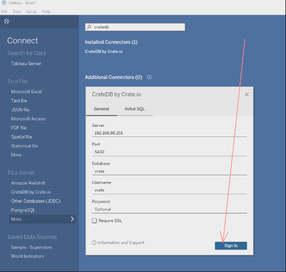
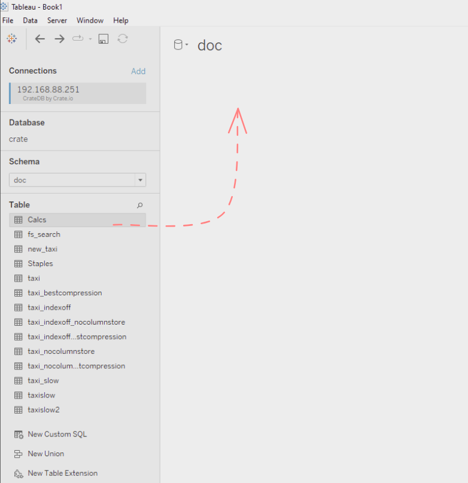
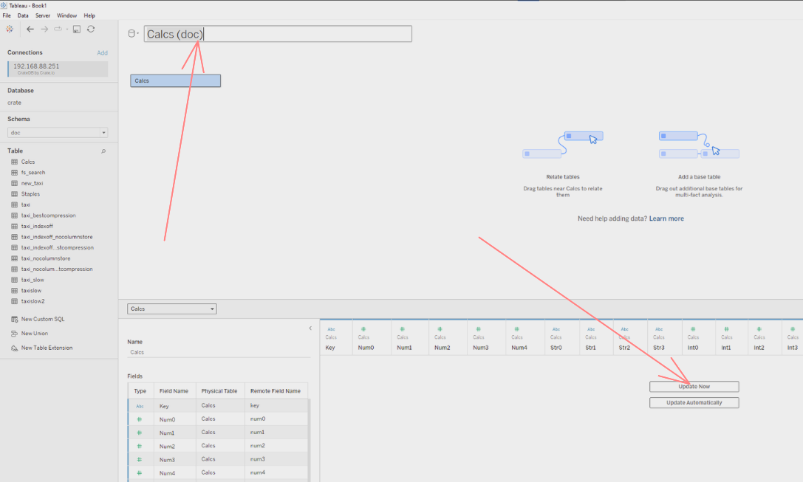
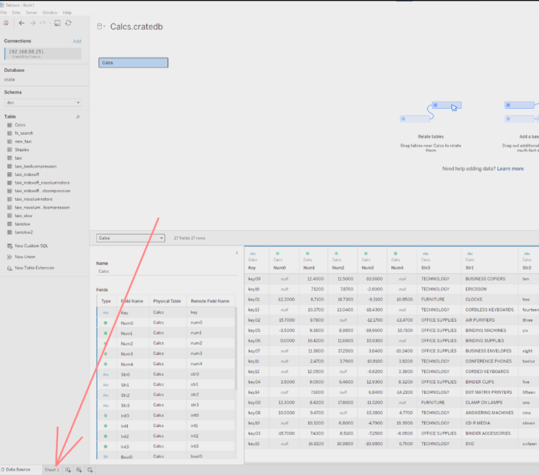
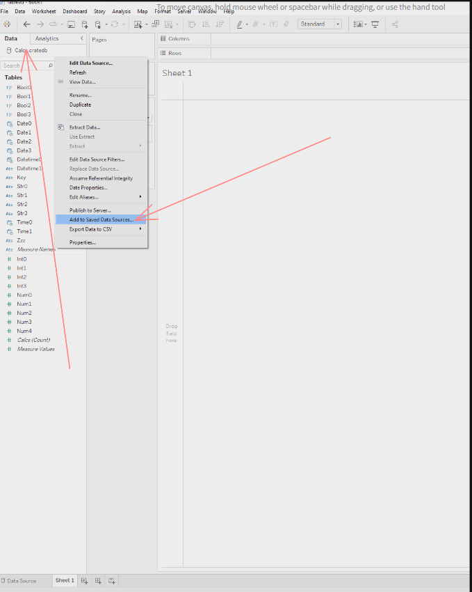
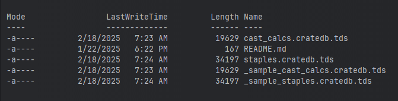
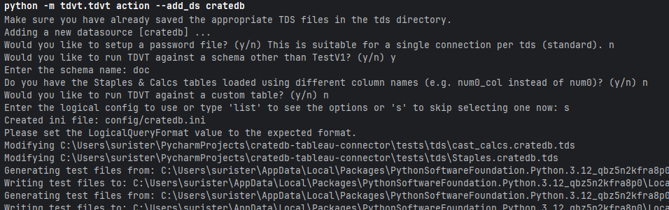

# How to set up tests.

# Setting up the environment:

## 1. Install tableau desktop.
Tableau test sdk needs a valid Tableau desktop installation (either Windows or MacOs) https://www.tableau.com/support/releases, and
hence a valid Tableau license. Without a license tests cannot be run.

Once Tableau Desktop is installed, log in selecting 'tableau cloud'.

## 2. Install dependencies.

MacOS
```shell
python3 -m pip install -r requirements.txt
```

Windows
```shell
py -m pip install -r requirements
```

Alternatively, with `uv`

```shell
uv venv
```
```shell
uv pip install -r requirements.txt
```

You should be able to now use `tdvt`.

```
python -m tdvt.tdvt
```

## 3. Clone ``cratedb-tableau-connector``
```shell
git clone git@github.com:crate/cratedb-tableau-connector.git
```

# Setting up the testing workspace:

Now that the environment is set up, we need to also set up the Tableau test files and data.

Tdvt workflow is documented here: https://tableau.github.io/connector-plugin-sdk/docs/tdvt, it is pretty lengthy, you
can follow the official `tdvt` docs or continue reading and do step by step.

Note: There is also a [50 minute video by the tableau team](https://www.youtube.com/watch?v=rAgnnByJIJA).
## Set up CrateDB.

The quickest way to set up CrateDB is by [using Docker](https://cratedb.com/docs/guide/install/container/).
```shell
docker run --publish=4200:4200 --publish=5432:5432 --env CRATE_HEAP_SIZE=1g --pull=always crate
```

## Set up ``tdvt`` execution profile.

1. Go to `./tests/config/tdvt/tdvt_override.ini` and put the path of your installation's `tabquerytool.exe`, for example
on a Windows machine it is: `C:\Program Files\Tableau\Tableau 2024.3\bin\tabquerytool.exe`
2. [Download datasets](https://github.com/tableau/connector-plugin-sdk/tree/master/tests/datasets/TestV1) and load both 
`calcs` and `staples` tables into the CrateDB instance. The script in `./data/setup_data.py` can be used to
automatically create the tables and load the data.

   MacOs
   ```shell
   python ./data/setup_data.py
   ```
   
   Windows
   ```shell
   py ./data/setup_data.py
   ```

3. Make the connector available by running Tableau with the option `-DConnectPluginsPath=/path_to_connectors`.

    The option can automatically be added by using MacOs's apple-script and Window's shortcut target.

    * On `Windows` the shortcut target (right click Tableau's shortcut) should look like:
    `C:\Program Files\Tableau\Tableau 2024.3\bin\tableau.exe" -DConnectPluginsPath=C:\PATH_TO_REPOSITORY\cratedb-tableau-connector`
   
    * On `MacOs` the apple script should look like:
   `do shell script "Applications/'Tableau Desktop 2024.3.app'/Contents/MacOs/Tableau -DConnectPluginsPath=/PATH_TO_REPOSITORY/cratedb-tableau-connector"`

    It is recommended to create two AppleScripts/shortcuts: one for development (the one just created) and a standard version.
    One for quick connector development and the other to test the user installation process outlined in the `README.md`

    At this stage, opening Tableau with `-DConnectPluginsPath`, the connector should appear:

    

4. Test connectivity with CrateDB.
   
   a. Open Tableau and click on 'more'
   
   
        
   b. Search for 'crate' and click on it.

   
   
   c. Introduce the credentials and Sign In.

   
   
   d. Pick a schema, usually 'doc', you should now be able to see all the tables and load data into a workbook.

   

5. Using Tableau Desktop create one Tableau data source (tds) for each table; Calcs and Staples with the 
name convection {table_name}.cratedb inside the directory `./tests/tds`
   
   a. Open Tableau Desktop and connect to the schema holding the `Staples` and `Calcs` tables using the instructions
      from step 4.
   
   b. With the mouse, drag the table 'Calcs' into the working area (big white sheet in the middle)
      
   

   c. Click on `Update now` to check that the data is properly loaded, then re-name the source to `cast_calcs.cratedb`.

   

   d. Click on `Sheet 1`

   
   
   e. Right click on the data source name, `cast_calcs.cratedb` and then click on `Add to Saved Data Sources`

   

   f. Save it to `./tests/tds`, this is the Tableau data source that tells Tableau how to access (with credentials) to
   the target table.

   g. Repeat the process with the `Staples` table, name it `staples.cratedb`.

   This is how the `./tests/tds` directory should look like:
   
   

   `_sample_staples.cratedb.tds` and `_sample_cast_calcs.cratedb.tds` are provided as examples of how they'd look like.
   Alternatively, as they only differ in the connection values, you could theoretically open the sample files, and
   add your CrateDB connection parameters, however this is not recommended as it might not work in the future, also if table
   schema changes, tds files would need to be re-created.

6. Create the Tableau tds tests. Important: Read all before running the command.

   Run the command `python -m tdvt.tdvt action --add_ds cratedb` inside the `./tests` directory.
   
   * When asked if `Would you like to run TDVT against a schema other than TestV1?`, pick yes, it is likely that you
   loaded the tables into the `doc` schema.
   * For the other options, pick no (n) or skip (s) to every other option, as we already ship the config file and password file.
   * If your CrateDB cluster **has** a password, open `./tests/tds/cratedb.password` and change `empty` for a valid password.

   The inputs should look like:
   
   

7. In `cratedb.ini` fill `CommandLineOverride` with 'DConnectPluginsPath' and the `cratedb_jdbc` path. Similarly, as we did in Step 3.

8. Run tdvt generate inside `./tests`.
   
   Command: `python -m tdvt.tdvt run cratedb --generate`, this only needs to be run when you modify `cratedb.ini`,
   if you modify the `dialect.tdd` file or any file within `cratedb_jdbc` directory, you **DO NOT** need to run it.
   
   Tests will run, it is ok for the first run to fail, subsequent runs **DO NOT**, need the `--generate` parameter.

9. Run tests inside `./tests`
   
   Command: `python -m tdvt.tdvt run cratedb --force-run`, the force-run parameter forces to keep running even when
   tests fail. 

   If everything went well, there should be more passed tests that failed.

## Debugging tests.

Everytime the tests are run, several logs files are generated in different places:

#### Run logs

These are generated in the directory you run the tests from, usually `./tests`
* `tabquery_logs.zip` - Logs for `tabquery.exe`, sometimes some connection issues can be seen here.
* `tdvt_log_combined` - Logs for `tdvt.tdvt` cli.
* `tests_results_combined.csv` - Results for tests, here we can see expected vs results, the most useful document for debugging, it is
recommended to use a proper CSV visualization tool that supports filtering and ordering, e.g. PyCharm (or any JetBrains ide),
Excel, Google sheet, Tableau...

Sometimes, some issues are also logged in Tableau's Desktop logs.

On Windows:
`C:\Users\YOUR_USER\Documents\My Tableau Repository\Logs`

On MacOs:
`/Users/YOUR_USER/Documents/My Tableau Repository/Logs`

Tableau server logs can be found [here](https://help.tableau.com/current/server/en-us/logs_loc.htm)

# Building and releasing.
The CI pipeline validates that the connector is valid, but it is not comprehensive enough and connectivity errors
could still be present.

If something else than the dialect is modified it is good practice to build beforehand and test the connector locally.

You can test:
* That the connector shows up properly in Tableau desktop.
* That basic connection and data visualization works in a CrateDB cluster.

## Building locally for testing.

Clone Tableau's [connector-plugin-sdk](https://github.com/tableau/connector-plugin-sdk), inside `cratedb-tableau-connector`.

In `\cratedb-tableau-connector\connector-plugin-sdk\connector-packager`

Run `python -m connector_packager.package \cratedb-tableau-connector\cratedb_jdbc` and perform an user installation
as explained in the README.md

Alternatively if you don't want to build locally, you can create a new release, set it as `draft` and download the
taco file generated in the release.

## Releasing

1. Make one commit/pull request where you bump up the version in `cratedb_jdbc/manifest.xml`, for example:

   Before: `<connector-plugin class='postgres_jdbc' superclass='jdbc' plugin-version='0.0.2' name='CrateDB' version='18.1' min-version-tableau='2020.4'>`
   
   After: `<connector-plugin class='postgres_jdbc' superclass='jdbc' plugin-version='0.0.3' name='CrateDB' version='18.1' min-version-tableau='2020.4'>`

2. Go to [releases](https://github.com/crate/cratedb-tableau-connector)  and click on `Draft new release`.
3. Create a new tag following the convention with the Target branch `main`.
4. Click on `Generate release notes`, amend the notes as needed and publish.
5. The pipeline will run and upload the taco file to the releases' assets, check that the pipeline
runs correctly and the file exists.